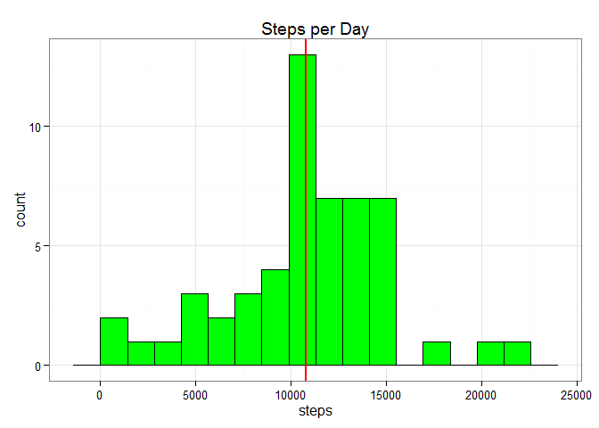

# Reproducible Research: Peer Assessment 1


## Loading and preprocessing the data
Sorry if my english is not good. 
Unzip the file in your working directory and load with R:

```r
library("lubridate")
library("ggplot2")
suppressMessages(library("dplyr"))
```

```
## Warning: package 'dplyr' was built under R version 3.1.3
```

```r
library("tidyr")
data<-read.csv("activity.csv")#read the data
data$date<-ymd(data$date)

steps_day<-aggregate(steps~date,data,sum,na.rm=TRUE)
```


## What is mean total number of steps taken per day?

making a histogram for steps per day


```r
summary(steps_day$steps)
```

```
##    Min. 1st Qu.  Median    Mean 3rd Qu.    Max. 
##      41    8841   10760   10770   13290   21190
```

```r
rango<-diff(range(steps_day$steps))
mean_step<-mean(steps_day$steps)
median_step<-median(steps_day$steps)

ggplot(steps_day, aes(x=steps), fill="green")+ geom_histogram(binwidth=rango/15, fill="green", colour="black")+theme_bw()+geom_vline(xintercept=mean_step, colour="red", size=1)+ggtitle("Steps per Day")
```

 

- The mean of steps per day is **10766**
- The median of the steps per day is: **10765**


## What is the average daily activity pattern?

  We need agrupapate the data by interval and generate the line plot
  
  

```r
steps_interval<-aggregate(steps~interval,data,mean,na.rm=TRUE)

ggplot(steps_interval, aes(x = interval, y = steps)) + geom_line(color = "blue")+ theme_bw()+ ggtitle("Average number of steps by interval")
```

 

```r
interval_of_maxsteps<-steps_interval[which.max(steps_interval$steps), ]$interval
```

  The interval where the mean of steps is max: **835**

## Imputing missing values

  We replace the NA values for the mean (easy way for imputing values)
  

```r
count_missing<-sum(is.na(data))
```

  There are **2304** missing values.
  
  

```r
imput_data<-data

for (i in 1:nrow(data)) {
    if (is.na(data$steps[i])) {
        imput_data$steps[i] = steps_interval[steps_interval$interval == data$interval[i],]$steps
    }
}
```

  Compare de imput data y the original data
  

```r
head(data)#original data
```

```
##   steps       date interval
## 1    NA 2012-10-01        0
## 2    NA 2012-10-01        5
## 3    NA 2012-10-01       10
## 4    NA 2012-10-01       15
## 5    NA 2012-10-01       20
## 6    NA 2012-10-01       25
```

```r
head(imput_data) #data with mean of steps by interval
```

```
##       steps       date interval
## 1 1.7169811 2012-10-01        0
## 2 0.3396226 2012-10-01        5
## 3 0.1320755 2012-10-01       10
## 4 0.1509434 2012-10-01       15
## 5 0.0754717 2012-10-01       20
## 6 2.0943396 2012-10-01       25
```

```r
imput_steps_day<-aggregate(steps~date,imput_data,sum)
```

  Lets calculate de mean, median and do the histogram
  

```r
imput_rango<-diff(range(imput_steps_day$steps))
mean_imput_step<-mean(imput_steps_day$steps)
median_imput_step<-median(imput_steps_day$steps)

ggplot(imput_steps_day, aes(x=steps), fill="green")+ geom_histogram(binwidth=imput_rango/15, fill="green", colour="black")+theme_bw()+geom_vline(xintercept=mean_imput_step, colour="red", size=1)+ggtitle("Steps per Day in the imput data")
```

 

- The mean of steps per day is **10766**
- The median of the steps per day is: **10766**

  The median now is much clouser to the mean.
  

```r
imput_interval_of_maxsteps<-imput_data[imput_data$steps == max(imput_data$steps), ]$interval
```

 and the interval with thw max number of steps is **615**
   
## Are there differences in activity patterns between weekdays and weekends?

  Firts, we need to create a varible "dia", that contain if the date is a weekend or weekday. 


```r
# LC_TIME="Spanish_Spain.1252" (Sys.getlocale("LC_TIME"))
# In my region Weekdays are Lunes, Martes, Miercoles, Jueves y Viernes and
# weekends are Sabado y Domingo


imput_data$dia<-ifelse(weekdays(imput_data$date)=="domingo" |weekdays(imput_data$date)=="sábado",c("weekend"),c("weekday"))

imput_data$dia<-as.factor(imput_data$dia)
```
  
  Now, plot the line graph for weekdays and weekends
  

```r
library(lattice)
imput_steps_dia <- aggregate(steps ~ interval + dia, imput_data, mean)
xyplot(steps ~ interval | dia, data = imput_steps_dia, layout = c(1, 2), type = "l")
```

 
